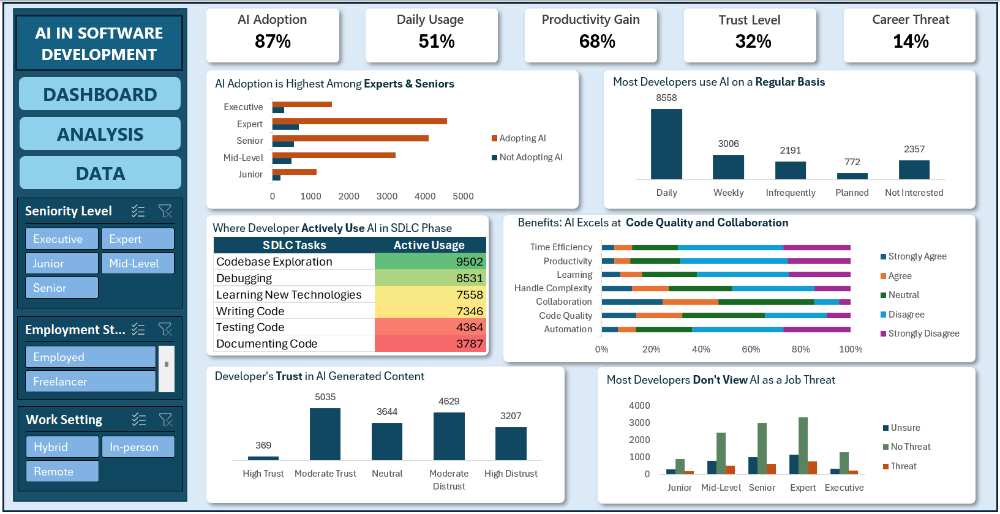

# AI-Adoption-Analysis-in-Software-Development
## Project Overview
This analysis is based on self-reported responses from the 2025 Stack Overflow Developer Survey and analyzes how developers are using AI Tools across Software Developement Lifecycle. It explores adoption trends, usage patterns, productivity impact, trust levels, and job security perceptions.

The goal is to provide clear, data-driven insights into how AI is shaping modern software development.
## Problem Statement
AI tools have rapidly become a standard part of the modern developer’s toolkit, yet high adoption doesn't always equal high confidence. While the majority of developers now use AI daily to speed up their workflow, a significant gap remains in how much they actually trust the resulting code. This analysis leverages the 2025 Stack Overflow Developer Survey to quantify these adoption patterns, evaluate perceived productivity gains, and the general attitude toward AI as a potential career threat.
## Key Questions
* What are the AI adoption rates among developers with different experience levels?
* How are developers using AI tools across the software development lifecycle (SDLC)?
* What impact does AI have on developer productivity and efficiency?
* What trust and reliability concerns do developers have regarding AI-generated outputs?
* Do developers perceive AI as a threat to their jobs?
## Dataset Details
Dataset Source: [2025 Stack Overflow Developer Survey](https://www.kaggle.com/datasets/edoardogalli/stack-overflow-annual-developer-survey-2025)
## Dashboard 

## Key Insights
* Widespread Adoption: 87% of developers have integrated AI tools into their professional workflows.
* Daily Integration: Over half (51%) of the workforce utilizes AI tools on a daily basis.
* Efficiency Gains: 68% of developers report perceived productivity improvements through AI.
* The Trust Gap: Despite high adoption, only 32% of developers express confidence in AI-generated outputs.
* Low Career Anxiety: Just 14% of developers perceive AI as a direct threat to their job security.
* Seniority Trends: Contrary to entry-level assumptions, AI adoption is highest among senior and expert-level developers.
* Primary Utility: AI is most actively leveraged for codebase exploration, debugging, and accelerated learning.

## Key Performance Indicators (KPIs)
* AI Adoption: 87%
* Daily Usage: 51%
* Productivity Gain: 68%
* Trust Level: 32%
* Career Threat: 14%

## Tools and Technologies
* Microsoft Excel (Power Query, Pivot Tables, Pivot Charts, Conditional Formatting, Slicers, Dashboard Design)

## Conclusion
The 2025 developer survey analysis reveals a "Paradox of Adoption": while AI integration is nearly universal ($87\%$) and perceived productivity is high, it has not yet earned full technical confidence. The low Career Threat ($14\%$) suggests that developers view AI as a functional assistant rather than a replacement. Ultimately, the future of AI in software development depends less on increasing adoption and more on closing the Trust Gap regarding code reliability.

